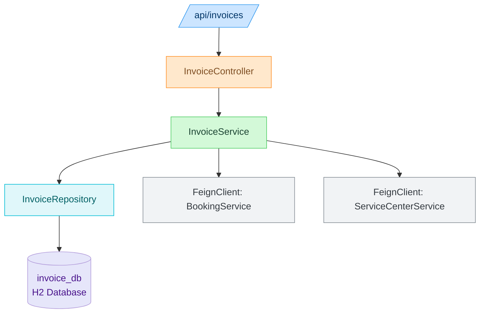
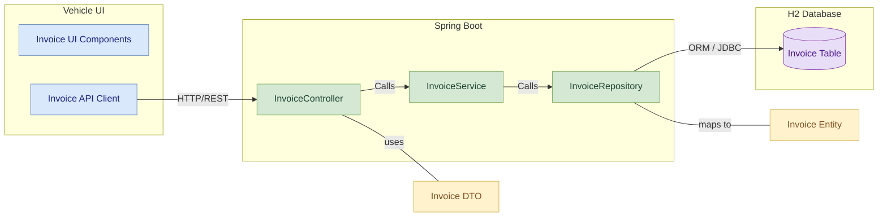
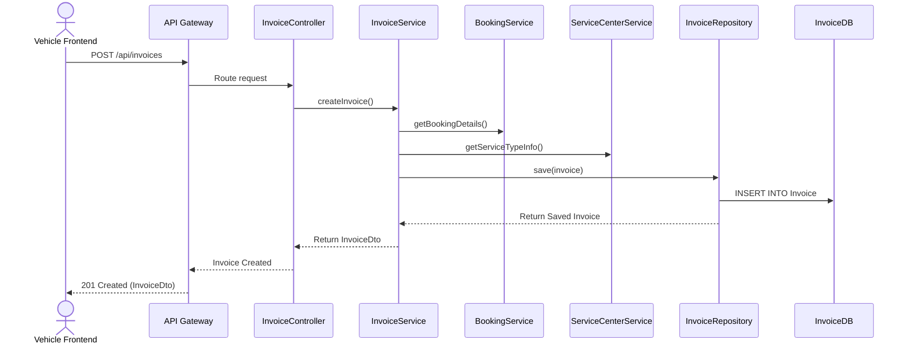

# Invoice and Billing Service

## Contributor
- Rajvardhan Shinde

## 📚 Table of Contents
- Overview
- Features
- Folder Structure
- REST API Endpoints
- Data Model
- Module Architecture Diagram
- Component Diagram
- Sequence Diagram
- Run Locally

---

## Overview
The Invoice and Billing Service is a Spring Boot microservice within the Vehicle Management System. It handles invoice generation, payment tracking, and PDF downloads. It communicates with other services like Booking and Service Center via Feign Clients and is registered with Eureka for service discovery.

---

## Features

- Generate invoices based on bookings and service types
- Track payment status
- Download invoice as PDF
- Integrate with Booking and Service Center services
- Registered with Eureka Discovery
- Routed via API Gateway

---

## Folder Structure
```plaintext
src/
└── main/
    ├── java/
    │   └── com.vehicle.invoice/
    │       ├── client/            # Feign clients for inter-service communication
    │       ├── config/            # Configuration classes (e.g., Feign, Swagger)
    │       ├── controller/        # REST controllers
    │       ├── dto/               # Data Transfer Objects
    │       ├── entity/            # JPA Entities
    │       ├── repository/        # Spring Data Repositories
    │       └── service/           # Business logic layer
    └── resources/
        └── application.properties  # App configuration
```

---

## REST API Endpoints

| Method | Endpoint                                 | Description                          |
|--------|------------------------------------------|--------------------------------------|
| POST   | `/api/invoices`                          | Generate invoice for a booking       |
| GET    | `/api/invoices`                          | Get all invoices for a user          |
| GET    | `/api/invoices/{id}`                     | Get invoice details                  |
| PUT    | `/api/invoices/{id}/status`              | Update payment status                |
| GET    | `/api/invoices/{id}/download`            | Download invoice PDF                 |

---

## Data Model

### Invoice Entity

| Field Name       | Data Type       | Description                              |
|------------------|------------------|------------------------------------------|
| `invoiceId`      | INT              | Primary Key, unique identifier           |
| `bookingId`      | INT              | Foreign Key referencing `BookingID`      |
| `serviceTypeId`  | INT              | Foreign Key referencing `ServiceTypeID`  |
| `totalAmount`    | DECIMAL(10,2)    | Total amount charged                     |
| `paymentStatus`  | VARCHAR(20)      | Status of the payment (e.g., Paid)       |

---

## Module Architecture Diagram



---

## Component Diagram



---

## Sequence Diagram



---

## Run Locally

```bash
# Backend
cd invoice-service
mvn clean install
mvn spring-boot:run
```

---
